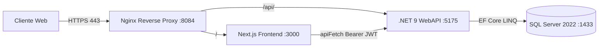

# iCalidad 25

Plataforma empresarial de Gestión de Calidad (SGC) construida con arquitectura desacoplada moderna: **Frontend en Next.js (React 19 / Tailwind CSS)** y **Backend en C# .NET 9 (Clean Architecture & Entity Framework Core)**.

---

## 🏛️ Arquitectura del Sistema



- **Frontend (`/frontend`)**: Next.js 14+ (App Router), Tailwind CSS, NextAuth.js (v5 Beta) con autenticación JWT Bearer.
- **Backend (`/backend`)**: C# .NET 9 con Clean Architecture (`Domain`, `Application`, `Infrastructure`, `WebAPI`).
- **Persistencia**: Entity Framework Core 9 agnóstico al motor de datos (proveedor predeterminado: Microsoft SQL Server).
- **Proxy Inverso (`/nginx`)**: Nginx Reverse Proxy con subred estática Docker y rate limiting en endpoints sensibles.

---

## ⚙️ Requisitos Técnicos de Instalación (Multi-Cliente)

Al desplegar `iCalidad` en una nueva infraestructura o cliente, se deben verificar las siguientes condiciones técnicas:

### 1. Requisitos de Base de Datos (SQL Server)
- **Versión de SQL Server**: SQL Server 2016 o superior (recomendado **SQL Server 2022 / Nivel 160**).
- **Nivel de Compatibilidad (CRÍTICO)**:
  - Si la base de datos se restaura desde un respaldo `.bak` antiguo (ej. SQL Server 2008 / nivel 100), **debe actualizarse el nivel de compatibilidad a 130 o superior** para soportar las instrucciones optimizadas `OPENJSON` generadas por EF Core en colecciones LINQ (`.Contains`):
  ```sql
  -- Verificar nivel de compatibilidad
  SELECT name, compatibility_level FROM sys.databases WHERE name = 'iCalidad';

  -- Homologar a SQL Server 2022 (Nivel 160) o mínimo SQL Server 2016 (Nivel 130)
  ALTER DATABASE [iCalidad] SET COMPATIBILITY_LEVEL = 160;
  ```
- **Parámetros de Cadena de Conexión**:
  - Para servidores sin certificados emitidos por una Autoridad Certificadora (CA) pública o entornos Dockerizados, la cadena de conexión debe incluir:
  ```ini
  TrustServerCertificate=True;Encrypt=True;
  ```

### 2. Variables de Entorno Requeridas

| Variable | Descripción | Ejemplo |
| :--- | :--- | :--- |
| `DB_HOST` | Host o IP del servidor SQL Server | `31.170.165.68` o `icalidad-sqlserver` |
| `DB_PORT` | Puerto de SQL Server | `1435` (Host) o `1433` (Docker) |
| `DB_NAME` | Nombre de la base de datos | `iCalidad` |
| `DB_USER` | Usuario de base de datos | `sa` |
| `DB_PASS` | Contraseña de base de datos | `********` |
| `JWT_SECRET` | Clave secreta para firma de tokens JWT (mínimo 256 bits) | `Base64String...` |
| `NEXTAUTH_SECRET`| Clave secreta para cifrado de sesiones NextAuth | `Base64String...` |
| `NEXTAUTH_URL` | URL pública de la aplicación | `https://icalidad.eliconacento.com` |

---

## 🚀 Despliegue con Docker Compose

Para levantar el entorno completo local o en servidor:

```bash
# 1. Clonar el repositorio
git clone https://github.com/EliNiperd/icalidad25.git
cd icalidad25

# 2. Configurar variables de entorno (.env)
cp .env.example .env

# 3. Construir y levantar contenedores
docker compose up -d --build
```

---

## 🛠️ Herramientas de Diagnóstico

El proyecto incluye utilidades para verificar el estado de la base de datos y la red:

```bash
# Ejecutar consulta SQL de verificación desde la consola
node frontend/scripts/db-query.js "SELECT @@VERSION AS Version, DB_NAME() AS CurrentDB"
```
